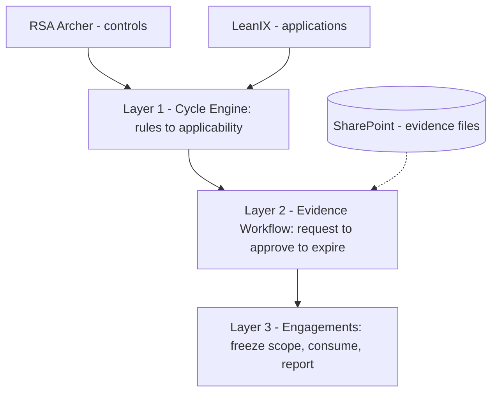
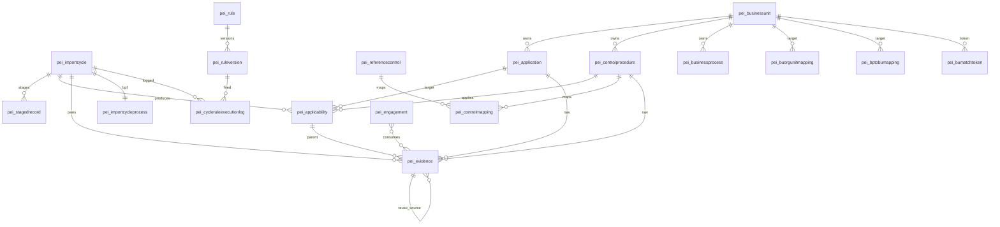
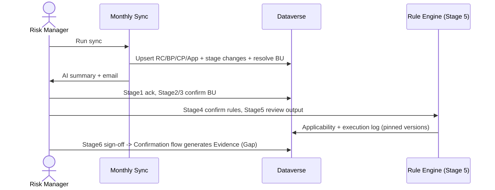
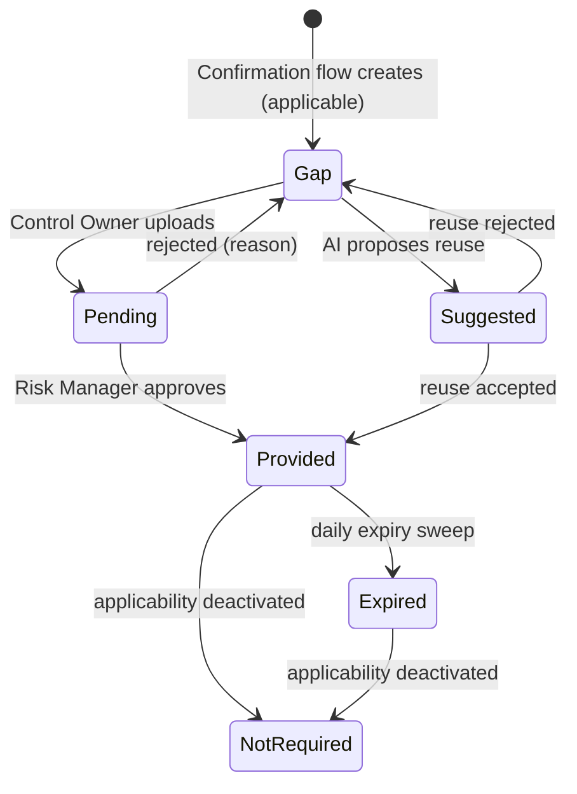

# EMS — Solution Design Document

**System:** Evidence Management System (EMS)
**Document type:** Solution Design Document — the target engineering design
**Audience:** Solution architects and Power Platform developers building EMS; testers; technical reviewers.

> This document describes EMS's **complete target design** — the architecture, data model, integration, rule engine, workflows, automation, security, UI, and non-functional posture, as the system is designed to be built. It is a design reference, not a status report; current build progress is tracked separately in the project's delivery tracker. For a jargon-free orientation, read the companion *EMS — The Full Story* guide first.

---

## 1. Purpose & audience

This is the engineering reference for EMS: the architecture, the full data dictionary, the integration field mappings, the rule-engine design, the per-flow designs, the security model, the non-functional posture, the UI, and the edge cases. It carries the real component and entity names a developer uses to build in the tenant.

## 2. Solution overview

EMS is a Microsoft Power Platform application (Dataverse, model-driven apps, Power Automate, AI Builder) that automates collection, organization, and audit-readiness of compliance evidence across an application portfolio. It is the intersection layer between two systems of record it reads from but never writes back to: **RSA Archer** (the control catalog — Reference Controls, Control Procedures, Business Processes) and **LeanIX** (the application portfolio and its attributes). EMS owns the relationship between them: which controls apply to which applications, what evidence is required, and whether that evidence is collected, approved, expired, or rolled forward.

The solution is **rule-driven** and runs on **two rhythms**: continuous, background evidence collection (a monthly cycle that applies a deterministic rule set to decide applicability and produce evidence records), and episodic engagements (audits and reviews that consume the steady-state evidence with their scope frozen at activation). The publisher prefix for all custom schema is **`pei_`**.

## 3. Scope

**In scope:** rule-driven applicability via a versioned rule set (Collection Scope is a property of each rule); the evidence lifecycle workflow (upload → approval → expiry → reuse); evidence reuse and gap detection; the six-stage guided cycle; engagements that consume evidence with frozen scope; AI-assisted evidence reuse (AI Builder).

**Out of scope:** source-system data quality (remediation stays in Archer/LeanIX); controls-framework authoring (Archer owns it); application-portfolio mastering (LeanIX owns it); engagement-driven collection (engagements consume, never create requirements).

Applicability is decided entirely by the rule set: **Collection Scope is a rule-level property, and applicability emerges from rule outcomes** — there is no separate per–Control-Procedure scope classification step.

## 4. Architecture overview

Three layers on a shared foundation, plus three cross-cutting concerns. Dependencies flow one way: Layer 1 produces what Layer 2 consumes; Layer 2's evidence is what Layer 3 audits.

| Layer | Responsibility | Cadence | Triggered by |
|---|---|---|---|
| **Foundation** | Master data, ingestion, and the base tables/flows everything else extends | — | (baseline) |
| **Layer 1 — Cycle Engine** | Rule-driven applicability decisions; produces Evidence | Every period (monthly) | Source refresh from Archer + LeanIX |
| **Layer 2 — Evidence Workflow** | Upload, approval, expiry, AI reuse | Always-on, per record | Layer 1 records; humans drive each |
| **Layer 3 — Engagements** | Audits, reviews, assessments | Episodic | A specific event |

Cross-cutting: Infrastructure (security/roles, environments), Documentation, Cutover (migration, training, go-live).

## 5. Technology & platform components

- **Dataverse** — all custom tables, columns, choices, and relationships; prefix `pei_`.
- **Model-driven apps** — the UI: a multi-screen suite on a shared "Navy Sidebar" shell (§12). Native by design, with one documented JavaScript exception (the Business-Process-Flow ↔ tab navigation script).
- **Power Automate** — the automation tier (§10). Protected-field writes run as a **service principal**, never by users. Orchestration is row-by-row (the platform's bulk dataflow path is not used).
- **AI Builder** — "Run a prompt" for the cycle-summary assessment and evidence-reuse matching. Copilot Studio is not used in the core workflow.
- **SharePoint** — evidence file storage, organized `/EMS/Evidence/[App]/[CP]/[date]/`.

## 6. Data model

### 6.1 Conventions

Column logical names below are the canonical tenant names — quoted **verbatim, including established spelling variants** (e.g. `pei_LeaxIXApplicationID`, `pei_InformationClasification`, `pei_ApplicationsNw`), because flow code binds to those exact names. Choice integer values follow the convention starting at `890920000`. The one delete-cascade that is a hard rule is `pei_ruleversion → pei_rule` = **Restrict Delete**.

### 6.2 Table inventory

| Table | Logical name | Columns |
|---|---|---|
| Import Cycle | `pei_importcycle` | 55 |
| Reference Control | `pei_referencecontrol` | 24 |
| Parent Business Process | `pei_businessprocess` | 15 |
| Control Procedure | `pei_controlprocedure` | 26 |
| Application | `pei_application` | 39 |
| Control Mapping (RC↔CP junction) | `pei_controlmapping` | 5 |
| Applicability | `pei_applicability` | 13 |
| Evidence | `pei_evidence` | 19 |
| Staged Record | `pei_stagedrecord` | 9 |
| Import Cycle Process (BPF host) | `pei_importcycleprocess` | (system) |
| User | `systemuser` | (built-in) |
| Business Unit | `pei_businessunit` | 3 |
| BU Org Unit Mapping | `pei_buorgunitmapping` | 6 |
| BU Match Token | `pei_bumatchtoken` | 4 |
| BP-to-BU Mapping | `pei_bptobumapping` | 6 |
| Rule | `pei_rule` | 11 |
| Rule Version | `pei_ruleversion` | 9 |
| Cycle Rule Execution Log | `pei_cycleruleexecutionlog` | 9 |
| Engagement | `pei_engagement` | — |
| Engagement Member | `pei_engagementmember` | — |

### 6.3 Entity-relationship diagram

> RC↔CP is many-to-many realized through `pei_controlmapping`. CP→BU and App/BP→BU are also carried as text identifiers resolved through the mapping/token tables — not all are Dataverse foreign keys (§7.5).

### 6.4 Data dictionary — core pipeline tables

**Import Cycle — `pei_importcycle`** (55 columns; BPF host; primary `pei_CycleName`; audit ON). Grouped:
- *Identity/control:* `pei_CycleName` (req, primary), `pei_Status` (Choice: Draft / In Progress / Completed / Superseded / Cancelled), `pei_SyncDate`, `pei_TriggeredBy`, `pei_SourceBatchID`, `pei_CompletedBy` (→ systemuser), `pei_CompletedOn`, `pei_OverrideJustification` (rich text), `pei_ImportWarnings`, `pei_CopilotAssessment` (AI summary), `pei_ValidationMessage` (gate-validation failures).
- *Count fields (whole number):* `pei_ReferenceControlsNew/Updated/Removed/Imported`, `pei_BusinessProcessesNew/Updated/Removed/Imported`, `pei_ControlProcedureNew` *(singular)*`/ControlProceduresUpdated/Removed`, `pei_ApplicationsNw`*/ApplicationsUpdated/ApplicationsDecommissioned*, `pei_CarriedForward`.
- *Six-stage gate fields (Yes/No, written by the service principal):* one acknowledgement/confirmation flag per stage — change acknowledged, application ownership confirmed, control ownership confirmed, rules confirmed, output confirmed, and cycle signed off.
- *Rollups (each with a `_State` + `_Date` companion):* `pei_ApplicabilityPending/Complete`, `pei_EvidenceGaps`, `pei_EvidenceLinked`.
- *Formula (text):* `pei_Stage1Summary … pei_Stage6Summary`. *System id:* `pei_ImportCycleId`.

**Reference Control — `pei_referencecontrol`** (24; Archer-sourced; primary `pei_ReferenceControlIdentifier`):

| Display | Schema | Type | Notes |
|---|---|---|---|
| Reference Control Identifier | `pei_ReferenceControlIdentifier` | Text | **Req, primary, match key** |
| Reference Control Title | `pei_ReferenceControlTitle` | Text area | |
| Reference Control Description | `pei_ReferenceControlDescription` | Multi-line | AI-classification input |
| Description | `pei_Description` | Rich text | distinct from above |
| Owner / Type / Frequency / Automation | `pei_ReferenceControlOwner/Type/Frequency/Automation` | Text | |
| Control Family / Standard / Standard ID / Section | `pei_ControlFamily/ControlStandard/ControlStandardID/ControlStandardSectionDetailed` | Text | |
| Internal Reference ID / NIST Alignment / Common Unit | `pei_InternalReferenceID/NISTAlignment/CommonUnit` | Text | |
| 3rd-party / Key / Classification / Technology assertion | `pei_Applicableto3rdParty / pei_KeyReferenceControl / pei_ReferenceControlClassification / pei_TechnologyAssertion` | Text | |
| Lifecycle Status | `pei_LifecycleStatus` | Choice | Active / Removed (source) |
| EMS Lifecycle Status | `pei_EMSLifecycleStatus` | Choice | EMS-managed, **field-secured** |
| Status | `pei_Status` | Text | Archer status |
| Source Data Hash | `pei_SourceDataHash` | Multi-line | change-detection hash |
| (system) | `pei_ReferenceControlId` | Unique id | |

**Parent Business Process — `pei_businessprocess`** (15; primary `pei_BusinessProcessIdentifier`). The logical name is `pei_businessprocess` (the long form `pei_parentbusinessprocess` is not valid). Key columns: `pei_BusinessProcessIdentifier` (req, primary), `pei_ProcessName`, `pei_BusinessProcessOwner`, `pei_BusinessProcessManagers`, `pei_ProcessLevel`, `pei_Segment`, `pei_CommonUnit`, `pei_InherentRiskRating`, `pei_Line1BStaff`, **`pei_owningbu`** (Lookup → `pei_businessunit`), **`pei_owningbumanual`** (Yes/No — preserves a curated owning-BU value), `pei_LifecycleStatus`, `pei_EMSLifecycleStatus` (field-secured), `pei_Status`, `pei_SourceDataHash`.

**Control Procedure — `pei_controlprocedure`** (26; primary `pei_ControlProcedureIdentifier`). Description is **`pei_Description`** (Rich text); Parent BP is stored as **text** (`pei_ParentBusinessProcess`), not a lookup.

| Display | Schema | Type | Notes |
|---|---|---|---|
| Control Procedure Identifier | `pei_ControlProcedureIdentifier` | Text | **Req, primary, match key** |
| Control Procedure Title | `pei_ControlProcedureTitle` | Text | |
| Description | `pei_Description` | Rich text | **evidence-affecting** |
| Owner / Coordinator / Status | `pei_ControlProcedureOwner/Coordinator/Status` | Text | |
| Frequency / Automation / Classification / Type / Effectiveness | `pei_ControlProcedureFrequency/Automation`, `pei_ControlClassification/ControlType/ControlEffectiveness/Frequency` | Text | |
| Self-Assessment / Design / Operating test results | `pei_MostRecentControlSelfAssessmentRating / …DesignEffectivenessTestResult / …OperatingEffectivenessTestResult` | Text | |
| Common Unit / Key Control No | `pei_CommonUnit / pei_KeyControlNo` | Text | |
| Parent Business Process | `pei_ParentBusinessProcess` | Text | **BP id as text** (drives BU inheritance, §7.5) |
| Reference Controls | `pei_ReferenceControls` | Multi-line | newline-separated RC ids; **evidence-affecting** |
| SOX | `pei_SOX` | Text | last Archer column |
| Owning BU | `pei_owningbu` | Lookup → `pei_businessunit` | derived (§7.5) |
| Lifecycle / EMS Lifecycle Status | `pei_LifecycleStatus / pei_EMSLifecycleStatus` | Choice | EMS one field-secured |
| Reviewed | `pei_Reviewed` | Yes/No | set by the confirmation flow; field-secured |
| Source Data Hash | `pei_SourceDataHash` | Multi-line | hash(Description \| Reference Controls) |

**Application — `pei_application`** (39; primary **`pei_DisplayName`** — the match key; LeanIX-sourced; import filter `Usage Type = "owner"`). A permanent special row `Display Name = "Enterprise"` (App ID `ENT-000`) represents org-wide / common scope and is never deleted. Two LeanIX-id columns exist (`pei_LeanIXID`, `pei_LeaxIXApplicationID`).
- *Identity:* `pei_DisplayName` (req, primary, match key), `pei_Name`, `pei_LeanIXID`, `pei_LeaxIXApplicationID`, `pei_ExternalID`, `pei_Type`.
- *The 15 evidence-affecting attributes (the rule-engine attribute catalog):* `pei_HostingType`, `pei_TargetHostingClass`, `pei_ApplicationCriticality`, `pei_SOXRelevant`, `pei_InformationClasification`, `pei_UsageType`, `pei_MFAProvider`, `pei_PartnerFacing`, `pei_PrivilegedAccess`, `pei_SingleSignOnAvailability`, `pei_SSOPattern`, `pei_WebApplication`, `pei_URLisaccessibleexternally`, `pei_CustomerFacing`, `pei_PenetrationTestingRequired`.
- *Owners/admin:* `pei_IIQStatus`, `pei_IIQAppNameorExceptionDetails`, `pei_BusinessOwner`, `pei_SecondaryBusinessOwner`, `pei_ITowner`, `pei_SecondaryITOwner`, `pei_PrimaryAssetOwner`, `pei_SecondaryAssetOwnerDelegate`, `pei_CurrentLifecycle`, `pei_OrgUnitDisplayName` (BU token input), `pei_ApplicationStatus`.
- *EMS-managed:* `pei_owningbu` (Lookup), `pei_owningbumanual` (Yes/No), `pei_LifecycleStatus` (Active / Decommissioned), `pei_EMSLifecycleStatus` (field-secured), `pei_Reviewed` (Yes/No, field-secured), `pei_SourceDataHash` (hash of the 15 key fields).

**Control Mapping — `pei_controlmapping`** (5; RC↔CP junction): `pei_Name` (primary), `pei_ReferenceControl` (Lookup → RC), `pei_ControlProcedure` (Lookup → CP), `pei_Status` (Active / Inactive), `pei_ControlMappingId`. Alt key on RC + CP.

**Applicability — `pei_applicability`** (13; the rule-engine output; parent of Evidence): `pei_Name`, `pei_ControlProcedure` (Lookup), `pei_Application` (Lookup), `pei_ImportCycle` (Lookup), **`pei_Applicability`** (Choice: Applicable 890920000 / Not Applicable 890920001), **`pei_ApplicabilityStatus`** (Active 890920000 / Inactive 890920001 — reclassification), `pei_ReviewDecision` (Pending / Accepted / Overridden), `pei_AIReasoning`, `pei_OverrideReason`, `pei_Status`, `pei_AssignedTo` (→ systemuser), `pei_ReviewedOn`. Alt key on CP + App + Import Cycle + Applicability Status (4 columns, so Active and Inactive coexist).

**Evidence — `pei_evidence`** (19; immutable after creation; never deleted; status-only changes). The status field is **`pei_EvidenceStatus`** (Choice).

| Display | Schema | Type | Notes |
|---|---|---|---|
| Name | `pei_Name` | Text | primary |
| Applicability | `pei_Applicability` | Lookup → applicability | parent |
| Control Procedure / Application / Import Cycle | `pei_ControlProcedure / pei_Application / pei_ImportCycle` | Lookup | navigation |
| **Evidence Status** | `pei_EvidenceStatus` | Choice | 6-state machine (§9.2); **field-secured** |
| Evidence Type | `pei_EvidenceType` | Choice | Screenshot / Document / Report / Configuration / Other |
| Evidence Description | `pei_EvidenceDescription` | Multi-line | auto-generated for gaps |
| File URL | `pei_SharePointURL` | Text | link to the stored file in SharePoint |
| Snapshot | `pei_SourceSnapshot` | Multi-line | immutable point-in-time copy of the CP and Application attributes at collection |
| Copilot Analysis | `pei_CopilotAnalysis` | Multi-line | AI reuse analysis |
| Source Control Procedure | `pei_SourceControlProcedure` | Text | CP a reused doc came from |
| Source Evidence | `pei_SourceEvidence` | Lookup → evidence (**self**) | evidence reuse |
| Collected By / On | `pei_CollectedBy (→ systemuser) / pei_CollectedOn` | Lookup / DateTime | |
| Requested From | `pei_RequestedFrom` | Lookup → systemuser | |
| Expiry Date | `pei_ExpiryDate` | Date | freshness |

**Staged Record — `pei_stagedrecord`** (9; the change log): `pei_Name`, `pei_ImportCycle` (Lookup), `pei_EntityType` (Choice: CP 890920000 / Application …001 / RC …002 / BP …003), `pei_WhatChanged` (New / Updated / Removed from Archer / Decommissioned / Reactivated), `pei_DisplayTitle`, `pei_ImpactonEvidence`, `pei_SourceDataJSON`, `pei_SourceDataHash`, `pei_StagedRecordId`.

### 6.5 BU foundation tables

- **Business Unit — `pei_businessunit`** (3): `pei_Name` (primary), `pei_bucode` (req, **alt key**), `pei_bustatus` (Active / Inactive). **Flat — no hierarchy**; seeded with peer BUs.
- **BU Org Unit Mapping — `pei_buorgunitmapping`** (6): `pei_Name` (primary "Org Unit Variant", **alt key**), `pei_targetbu` (Lookup → BU), `pei_mappingstatus` (Unresolved / Mapped / Ignored), `pei_affectedrecords`, `pei_firstseen`, `pei_notes`. The Tier-2 exception layer.
- **BU Match Token — `pei_bumatchtoken`** (4): `pei_Token` (primary), `pei_bu` (req, Lookup → BU), `pei_active` (Yes/No), `pei_priority`. The Tier-1 token catalog.
- **BP-to-BU Mapping — `pei_bptobumapping`** (6): `pei_ParentBusinessProcessIdentifier` (primary, **alt key**), `pei_targetbu` (Lookup → BU), `pei_mappingstatus` (Unresolved / Mapped / Ignored / Inactive), **`pei_ownershiptype`** (Global Choice: BU-owned 890920000 / Horizontal 890920001 / Unresolved 890920002), `pei_affectedrecords`, `pei_firstseen`, `pei_notes`.

### 6.6 Rule-engine tables

**Rule — `pei_rule`** (primary `pei_rulename`; audit ON; Quick Create ON; alt key `AK_Rule_Name`):

| # | Display | Schema | Type | Notes |
|---|---|---|---|---|
| 1 | Description | `pei_description` | Text 2000 | opt |
| 2 | Conditions JSON | `pei_conditionsjson` | Text 100,000 | **req**; grammar per §8.2 |
| 3 | Plain-English Rendering | `pei_plainenglish` | Text 4000 | written by the renderer |
| 4 | Output | `pei_output` | Choice `pei_ruleoutput` | Applicable 890920000 / Not Applicable 890920001 |
| 5 | Collection Scope | `pei_collectionscope` | Choice `pei_rulecollectionscope` | Per app — all 890920000 / Per app — same BU …001 / Per BU/BP …002 |
| 6 | Priority | `pei_priority` | Whole number | 0–999999, default 10; lower runs earlier |
| 7 | Terminating | `pei_terminating` | Yes/No | short-circuit flag |
| 8 | Status | `pei_rulestatus` | Choice `pei_rulestatus` | Draft 890920000 / Active 890920001 / Inactive 890920002 |
| 9 | Effective From | `pei_effectivefrom` | DateTime | req |
| 10 | Effective To | `pei_effectiveto` | DateTime | opt; null = open-ended |
| 11 | Current Version | `pei_currentversion` | Whole number | denormalized; bumped on Activate |

**Rule Version — `pei_ruleversion`** (primary `pei_versionlabel`; Quick Create **disabled** — written only by the versioning plugin; cascade to `pei_rule` = **Restrict Delete**): `pei_rule` (Lookup, req), `pei_versionnumber` (req; alt key `AK_RuleVersion_Rule_VersionNumber` on Rule + Number), `pei_conditionsjsonsnapshot` (Text 100,000, immutable), `pei_outputsnapshot` (reuse `pei_ruleoutput`), `pei_effectivefrom/to`, `pei_changedby` (→ systemuser), `pei_changereason`. Collection-Scope and Plain-English snapshots are not stored separately — reach is recoverable through the Rule, and the plain-English form is re-derivable.

**Cycle Rule Execution Log — `pei_cycleruleexecutionlog`** (read-only at platform level — rows written only by the evaluation flow): `pei_ruleversionid` (Lookup), `pei_ruleversionjsonsnapshot` (Text — the embedded pinning copy), `pei_cycleid` (Lookup → Import Cycle), `pei_controlprocedureid` (Lookup), `pei_applicationid` (Lookup), `pei_evaluationresult` (Choice: Applicable / Not Applicable / Error), `pei_errormessage`, `pei_evaluatedat`, `pei_evaluatorversion`. The shared option sets `pei_ruleoutput / pei_rulecollectionscope / pei_rulestatus` are created with the Rule table and reused.

### 6.7 Engagement tables

- **Engagement — `pei_engagement`**: `pei_engagementname` (primary), `pei_engagementtype` (Choice — the six engagement kinds, §9.3), `pei_status` (transitions align with scope-freeze-at-activation), `pei_startdate`, `pei_enddate`, `pei_leadauditorid` (→ systemuser). The **Scope** set (business units, business processes, framework, time window) is many-valued, realized through junctions to BU and BP and a framework multi-select, frozen at activation.
- **Engagement Member — `pei_engagementmember`**: the junction scoping Auditors to Engagements — Lookup → engagement + Lookup → systemuser.

## 7. Integration design

### 7.1 Source systems & ingestion

Four monthly Excel files land in SharePoint `…/Inbox/{Source}/`, each with one **case-sensitive named table**, read by the **Monthly Sync flow** via the **Excel Online (Business)** connector, row by row. Files archive to `…/Archive/{Source}/` after processing (via get-file + create-file). Source normalization happens at submission time — the flow has no defensive header fallbacks.

| Source | File / table | EMS target | Match key |
|---|---|---|---|
| Archer | `ReferenceControls-*.xlsx` / `Referencecontrols` | Reference Control | Reference Control ID |
| Archer | `BusinessProcesses-*.xlsx` / `Business Process` | Parent Business Process (`pei_businessprocess`) | Business Process ID |
| Archer | `ControlProcedures-*.xlsx` / `ControlProcedures` | Control Procedure | Control Procedure ID |
| LeanIX | `Applications-*.xlsx` / `ApplicationsList` | Application | **Display Name** (+ App ID) |

### 7.2 Archer field mappings (selected, source → EMS)

- **Reference Controls:** `Reference Control ID → pei_ReferenceControlIdentifier`, `Title → pei_ReferenceControlTitle`, `Description → pei_ReferenceControlDescription`.
- **Business Processes:** `Business Process ID → pei_BusinessProcessIdentifier`, `Process Name → pei_ProcessName`, `Owner → pei_BusinessProcessOwner`, `Manager(s) → pei_BusinessProcessManagers`.
- **Control Procedures:** `ID → pei_ControlProcedureIdentifier`, `Title → pei_ControlProcedureTitle`, `Description → pei_Description`, `Owner/Coordinator/Status → pei_ControlProcedure{Owner,Coordinator,Status}`, `Common Unit → pei_CommonUnit`, `Parent Business Process → pei_ParentBusinessProcess` (drives BU derivation), `Reference Controls → pei_ReferenceControls` (**newline-separated** RC-id list → parsed into `pei_controlmapping` rows), `Key Control No → pei_KeyControlNo`, `SOX → pei_SOX`.

### 7.3 LeanIX field mappings (Applications)

The Monthly Sync flow reads ~32 columns into `pei_application`; match key **`pei_DisplayName`** (blank → row skipped); import filter **`Usage Type = "owner"`** (case-insensitive). Load-bearing: `Org Unit Display Name → pei_OrgUnitDisplayName` (the BU-resolution input); the **15 evidence-affecting attributes** (§6.4) are the rule-engine's attribute catalog.

### 7.4 Change detection

EMS uses **match-key upsert + a per-record `pei_SourceDataHash`** (hash of the evidence-affecting fields), not a separate delta store. Per row, the 3-path decision is: *was removed?* → reactivate (+ stage); else *hash changed?* → update + **stage** a Staged Record; else → silent update (no stage, suppressing review fatigue on cosmetic drift). Removed records (absent from the feed) are handled by a **decommission sweep** that deactivates — never deletes. Only EMS-owned changes are surfaced.

### 7.5 BU-resolution algorithm

BUs are a **flat catalog**. Resolution differs by entity, and is gated everywhere by the manual-override flag (`pei_owningbumanual = Yes` preserves the curated value):

- **Application side — two-tier.** Tier 1: split `Org Unit Display Name` on `/`, trim, test each segment for **exact path-segment equality** against active `pei_bumatchtoken`. 1 match → resolve; 2+ → ambiguous → Unmapped; 0 → fall to Tier 2. Tier 2: strict full-string match against `pei_buorgunitmapping` → resolve (Target BU set) / Unmapped (Target BU empty) / auto-create an Unresolved row (no match). *(The two-tier scan collapses its conditions to respect Power Automate's 8-level nesting cap — §10.)*
- **Business-Process side — admin classification (not derived).** `pei_bptobumapping.pei_ownershiptype` is a **human admin judgment** (BU-owned / Horizontal), set across a small number of BPs, never automatic; new BPs default Unresolved and surface at Stage 3.
- **Control-Procedure side — the 4-way branch + translation layer.** The CP reads its Parent BP's mapping row and translates Ownership Type into the CP's Owning BU via a Switch: (1) manual override → preserve; (2) BP = BU-owned → CP inherits Target BU; (3) BP = Horizontal → CP gets a designated shared/enterprise BU; (4) BP = Unresolved / no-match → CP Owning BU cleared, queued for Stage-3 admin attention. A cycle never blocks on unresolved records (graded closure).

### 7.6 The four-quadrant evidence model

CP ownership (Horizontal vs BU-owned, from BP classification) crosses with the Rule's Collection Scope (common vs per-app) to yield four observable evidence patterns. **There is no fifth "Hybrid" quadrant** — hybrid behavior is emergent from attaching two rules to one CP (rule composition):

| | Per BU/BP scope | Per-app scope |
|---|---|---|
| **Horizontal** | Horizontal Common (1 record, no BU) | Horizontal Per-App (1 per app, no BU filter) |
| **BU-owned** | BU Common (1 record on Owning BU) | BU Per-App (1 per app where `App.OwningBU = CP.OwningBU`) |

### 7.7 Automated evidence consumption

> **Scope of this section.** The integration is defined here at the **architectural level** — the sources, the evidence each supplies, and the routing pattern below are settled. The **detailed per-source design** — field mappings, the ingestion contract, the evidence-to-control mapping, and the per-source flow — is elaborated source by source as the integration layer is designed, to the same build-ready depth the Archer/LeanIX ingestion carries in §7.1–7.5. This section is the contract those per-source designs implement; it intentionally fixes the *pattern* and leaves the *per-source detail* to be specified with each source's onboarding.

Beyond evidence that a Control Owner uploads, EMS consumes evidence **directly from the systems that already produce it** — continuous controls monitoring. Evidence arrives through **three input modes**: connected source systems read via read-only connectors; the outputs of upstream control-monitoring platforms flowing downstream as inputs; and manual owner-provided artifacts where automation isn't possible. People act as **exception-handlers and reviewers** rather than the primary evidence supply.

The integration is a **hybrid**: Power Automate is the orchestration backbone and the direct integration layer for sources with first-class connectors; **Azure Functions** handle the complex sources whose payloads or transformations don't fit Power Automate's expression language. Archer/LeanIX file-based ingestion is unchanged.

| Source | Evidence it supplies | Integration route |
|---|---|---|
| **GitHub** | Pull-request reviews, branch policies, deployment approvals | Standard connector → Power Automate (direct) |
| **ServiceNow** | Change records, incident remediation, access requests | Premium standard connector → Power Automate (direct) |
| **Qualys** | Vulnerability and configuration-scan evidence | Azure Functions (Python) → Power Automate |
| **SailPoint IdentityIQ** | Access certifications, role assignments, segregation-of-duties checks | Azure Functions (Python) → Power Automate |
| **Application-layer APIs** | Configuration snapshots, audit logs, transaction samples | Custom-connector framework (Azure Functions for complex cases) |

Under this model, files still reside in SharePoint via EMS; a connected source is an evidence-supply channel, and a team's work-tracking tool (where used for request delivery) is a notification surface, not the system of record. The heavier interpretation workload of reading heterogeneous evidence draws on the broader Power Platform AI stack.

## 8. Rule engine design (Layer 1 core)

### 8.1 Model
**Rules are data, not code** — so auditors read rules directly. Two tables: `pei_rule` (the editable rule, Draft → Active → Inactive) and `pei_ruleversion` (immutable per-Activate snapshot). Schema in §6.6.

### 8.2 Expression grammar
The rule condition is JSON over a **closed, 12-operator set** — `equals, not-equals, in, not-in, greater-than, less-than, exists, contains, starts-with, matches, isNull, isNotNull` — combined with the connectives `and / or / not`, evaluated against an **attribute catalog** over Application (the 15 fields), Control Procedure, Reference Control, and Business Unit. An **unknown operator is a hard failure**; an **unknown attribute is a warning**. Collection Scope is a rule-level property; rule versions are auto-created on Activate; cycle pinning captures the rule version id **plus an embedded immutable JSON copy**; rules are soft-deleted (deactivated, never destroyed); priority uses a numeric gap so rules can be re-ordered without renumbering.

### 8.3 Evaluation algorithm
Runs at **Stage 5 (Review Output)** and produces deterministic Applicable / Not-Applicable decisions:
1. **Pin first.** Capture each active rule's Version id **and** an embedded immutable JSON copy. Inactive rules are excluded; only Active rules participate.
2. **Priority order** ascending `pei_priority` (lower first).
3. **Terminating short-circuit.** A firing terminating rule stops evaluation for that (CP × App) pair — this flattens Boolean trees into priority + terminating (required to respect Power Automate's 8-level nesting cap; deep AND-trees are forbidden).
4. **NULL-as-error.** A rule referencing a NULL field **errors for that record**, is logged to the execution log, and the record is treated Not Applicable — never silently coerced (which surfaces data-quality issues). This is expected to fire regularly, since source fields are frequently optional.
5. **Combine by union.** Firing rules produce applicability; Collection Scope decides the shape (§7.6). Each firing leaves a forensic log row.

### 8.4 Plugins
- **Versioning:** a synchronous pre-operation plugin on `pei_rule` Update with a pre-image; on **Activate**, it writes a `pei_ruleversion` row, stamps Effective-To on the prior version, increments `pei_currentversion`, and captures user/time/reason — exactly one version per edit (re-entrancy-guarded). Draft edits are in place; reactivation flips status with **no new version**.
- **Validation:** a synchronous plugin on Create + Update (filtered to `pei_conditionsjson`) with four checks — parseable JSON; balanced groups; recognized operator (unknown → **hard-fail**); valid attribute (unknown → **warn**). This is a plugin because a declarative business rule cannot parse JSON.

### 8.5 Execution log
`pei_cycleruleexecutionlog` (§6.6) — the immutable forensic record, rows written only by the evaluation flow.

## 9. Process / workflow design

### 9.1 The six-stage cycle (Layer 1)
Total Risk-Manager effort ≈ **12–22 min/cycle**. Gates can never be unticked (cancel-and-restart, or a reopen workflow, are the only escapes).

| Stage | What happens | Gate |
|---|---|---|
| 1 Detect Changes | Ingest extracts; identify new/changed/removed; AI summarizes | Acknowledge summary |
| 2 Verify Application BU | Resolve owning BU for changed apps; flag unresolved | Confirm resolution |
| 3 Verify Control Procedure BU | Resolve owning BU for changed CPs; flag unresolved | Confirm resolution |
| 4 Confirm Rules | Review the active rule set in plain English (read-only) | Confirm rules |
| 5 Review Output | Engine produces deterministic applicability; review + anomalies | Confirm output |
| 6 Sign-off | Close cycle; set reviewed flags; deactivate removed; notify | Sign-off |

### 9.2 Evidence lifecycle (Layer 2) — state machine
Six states on `pei_EvidenceStatus`; all transitions by the service-principal flow; **forward-only**.

### 9.3 Engagement flow (Layer 3)
Create with scope → **freeze at activation** (later source changes apply only to future cycles) → consume Layer-2 evidence as gap-revealing views → on close, produce a summary. Engagements **observe**, never modify evidence; auditors see only their engagement's records (via `pei_engagementmember`). Six engagement kinds share one shape, differing in scope rules and finding categories: **SOX quarterly checks, regulator inquiries, internal control reviews, vendor-risk assessments, incident reviews, and external audits.**

## 10. Automation / flow design

| Flow | Layer | Purpose |
|---|---|---|
| **Monthly Sync** | Foundation→L1 | Ingest the four extracts; 3-path upsert + staging; BU resolution for apps/BPs/CPs; decommission sweep; carry-forward; AI cycle summary; email the Risk Manager; two-state close (changes → In Progress; none → auto-Complete) |
| **Gate Validation** | L1 | Reverts an invalid gate tick; checks the actual table (not the stale rollup); concurrency re-read before revert; exits on its own self-retrigger (no loop) |
| **Stage-3 Dispatch / Match / Resolution** | L1 | Dispatch changed CPs, match Apps↔CPs, resolve applicability |
| **Evidence Generation** | L1 | Creates Evidence at the Stage-3 gate |
| **Confirmation** | L1→L2 | Deactivates removed records, generates **Gap** Evidence, completes the cycle |
| **Evidence Reuse (AI)** | L2 | Proposes reuse matches against existing valid evidence |
| **Upload / Approve / Reject / Suggestion-Decision** | L2 | The evidence state-machine transition flows |
| **Daily Expiry Sweep** | L2 | The scheduled flow moving Provided → Expired |

**Monthly Sync detail.** Trigger: **manual**, run by the Risk Manager (with a scheduled child-flow wrapper). It initializes its variables → runs a file-discovery existence gate (terminate-success if all empty) → import-cycle management (supersede prior, create new) → RC processing (silent) → BP processing (+ BP-side BU resolution + decommission sweep) → CP processing (3-path upsert) → App processing (3-path + App-side BU resolution + decommission + summary) → carry-forward orchestration → unreviewed catch-up sweeps → finalization (counter rollup → AI "Run a prompt" summary → email → two-state close). Error handling is per-file parallel failure branches with header-valid guards; file selection takes the first matching file per source folder. Operational parameters (notification recipients, option-set values) are configuration, not hardcoded.

AI is **AI Builder "Run a prompt"** only.

## 11. Security & access design

### 11.1 The seven production roles

| # | Role | Scope mechanism | Population | Primary surface |
|---|---|---|---|---|
| 1 | System Admin | Org-wide | 1–3 | Admin (Rules Catalog, BU Config) |
| 2 | Risk Manager | **BU-scoped** (single BU/assignment, via `pei_owningbu`) | 5–50 | Cycle mgmt, master data, evidence |
| 3 | Control Owner | **Per-record** (Owner lookup on CP/Applicability) | 50–500 | Control Owner Portal |
| 4 | Control Tester | Org-wide **read-only** | 10–100 | Read-only browse |
| 5 | Auditor | **Engagement-scoped** (`pei_engagementmember`) | per engagement | Engagement areas; writes findings |
| 6 | Stakeholder | Org-wide read-only **aggregates** | 5–20 | Dashboards / summaries |
| 7 | System | **Service principal** (Azure AD app) | 1 | Runs all flows |

Scoping is **deliberately non-uniform** — each role's mechanism matches its work.

### 11.2 The service-principal-writes-protected-fields pattern (the security backbone)
No human — including System Admin — writes field-secured columns directly. Humans trigger UI actions; **flows write as the service principal**. Protected fields include `pei_Reviewed`, `pei_EMSLifecycleStatus`, `pei_EvidenceStatus`, the snapshot fields, and the gate fields after tick. The protected master tables (`pei_controlprocedure`, `pei_application`, `pei_referencecontrol`, `pei_businessprocess`) are **strictly immutable to humans — no break-glass override**. The one documented exception is `pei_owningbu`, which is human-editable, gated by `pei_owningbumanual`.

### 11.3 One-way transitions
Cycle gates can't untick; master fields lock once flow-set; Evidence status moves forward only. "Backward" means a fresh record next cycle.

### 11.4 Privilege model
The access model is the seven roles (§11.1), their scope mechanisms, the service-principal write pattern (§11.2), and the flat-BU model, realized as a per-table CRUD privilege grid, the role definitions, and the field-level security profiles that protect the secured columns. Authentication (human MFA, session, conditional access) is tenant configuration; data encryption is inherited from Dataverse and SharePoint; recoverability is architectural (a missing or stale record is corrected by re-running, never a corruption to repair).

## 12. User interface design

- **App shell:** a native model-driven app (no Canvas, PCF, or custom HTML) on a shared "Navy Sidebar" shell — a multi-screen suite on consistent native patterns.
- **Sitemap:** grouped by Workflow (Import Cycles); Reference Data (Control Procedures, Applications, Reference Controls, Parent Business Processes); Applicability; and My Work (Evidence). Staged Records and Control Mappings are sub-grid-only. Role-targeted areas (Admin, the Control Owner Portal, Engagements, Dashboards) follow the seven-role model.
- **Import Cycle screen:** the cycle-management screen for the Risk Manager — one main "Cycle" tab plus the six per-stage sections, each with its staged/working sub-grid and its gate. Stage 3 hides "Enterprise" applicability rows (created pre-Accepted so they don't block the gate). The command bar is reduced to the working set of actions.
- **Forms:** Control Procedure (Identify / Description / Mappings / Applicability / Evidence sections), plus the Staged Record, Evidence, Application, Reference Control, Business Process, Applicability, and Control Mapping forms, on native patterns.
- **The one JavaScript exception:** a ~20-line script binds Business-Process-Flow stage changes to form tabs (Stage 1 → tab 2 … Stage 6 → tab 7); the form lands on Overview by design. A native extensibility point that fails gracefully.
- **Native-MDA design constraints (observed and designed around):** business rules can't target sub-grids; can't toggle section visibility; sub-grids don't support 2-hop relationship filtering; some legacy command-bar buttons can't be hidden through Command Designer; formula columns have limited date arithmetic.

## 13. Non-functional design

| Attribute | Target | Posture |
|---|---|---|
| Security | 7 roles (with population bands) | RBAC, non-uniform scoping. The numbers are populations, not SLAs |
| Auditability | — | Architecture-produced: every write attributable to a flow run; evidence and rule snapshots reconstructable |
| Integrity & Retention | 6-state evidence machine, forward-only; retention **permanent** (never deleted) | Service-principal-only writes + one-way transitions |
| Maintainability | Native, with one documented JavaScript exception | Low-code by eliminating bespoke code |
| Reliability | Established against a production baseline | Worst case is a missing or stale record (re-run), not corruption |
| Availability | Established against a production baseline | Inherits the Power Platform availability commitment |
| Performance | Established against a production baseline | Full-portfolio applicability time at scale is sized against the baseline |
| Scalability | Established against a production baseline | Portfolio scale is a design premise, validated against the baseline |
| Compliance | 6 engagement kinds | EMS is itself a compliance instrument |

## 14. Edge-case / error-handling catalogue

- **Source-data scenarios:** new (create + hash + stage); no-change (idempotent, no stage); key change (re-hash + stage); **removal** (deactivate, never delete; active engagements unaffected); reappearance (reactivate + stage); rename = removal + new creation (by design); duplicate IDs (last wins + warning); empty match key (skip + warning); header-only file (no-op, must not trigger removal); missing file (skip entity, including removal); large extracts (pagination enabled); prior cycle In-Progress (carry forward unreviewed, deduplicated); unreviewed records (`pei_Reviewed` re-stages each run until the confirmation flow clears it); read failure (parallel failed/timeout branch; downstream runs after success + fail + skip); zero changes (auto-complete, gates set, status locked).
- **Cycle lifecycle:** auto-supersede prior cycles (one active at a time; staged records orphaned, kept); manual cancel locks gates instantly (no rollback); cancel mid-process keeps prior stages valid.
- **Flow-specific:** Gate Validation reverts a gate then exits on its self-retrigger (no loop), checks the actual table (not the stale rollup), and re-reads under concurrency before reverting. Reclassification is **deactivate-then-recreate** (preserves audit; relies on the 4-column Applicability alt key so Active and Inactive coexist). The Confirmation flow defensively re-reads all prior gates and terminates-success if any are No.
- **Design principle from the data:** never use a denormalized counter as a decision authority — count the actual records. (A zero-change month must not auto-complete a cycle that still holds unreviewed records.)
- **Reusable code patterns:** prefer a single bulk `List rows` + in-memory `first(filter())` over a per-row `Get a row by ID` in a loop; use the Filter-array action rather than a `filter()` expression (which isn't a Power Automate function).

## 15. Key design decisions & rationale

- **Rules as data, not code.** Auditors read rules directly. Non-negotiable.
- **Collection Scope on the rule, not the Control Procedure.** Applicability emerges from deterministic rule outcomes; there is no separate Common / Application-Level / Hybrid classification.
- **Immutability + snapshots.** Evidence, rule versions, and execution logs are immutable with point-in-time snapshots; nothing is deleted.
- **One-way transitions everywhere.** Corrections happen forward, as new records.
- **Engagement scope freezes at activation.** The audit ground never shifts.
- **Service principal owns protected writes.** A clean audit trail; no break-glass; no undo UI.
- **Flat business units; two-tier token + mapping BU resolution; symmetric manual override.**
- **Non-uniform role scoping** — each role's reach matches its work.

## 16. Environments, build & release

Publisher prefix `pei_`. **Build discipline:** schema and flows are built one block at a time with verification after each; primary-column display and schema names are set **before first save** (the logical name locks at save). Production evidence is permanent and immutable; development data is test-only and not migrated. Release and cutover (migration, training, go-live) are part of the cross-cutting Cutover concern.

## 17. Implementation sequence (dependency order)

The architecture's dependency structure — what must exist before what:

1. **Rule Engine (Layer 1 core)** — the rule and rule-version tables, the expression grammar, the validation and versioning plugins, the parser/evaluator, the execution-log table, and the evaluation flow. Unblocks everything downstream.
2. **Six-stage cycle UI** — the guided, gated review experience.
3. **Evidence Workflow (Layer 2)** — the lifecycle, the four transition flows, the Control Owner Portal, the daily expiry sweep, and AI reuse, plus the Evidence file-URL and snapshot columns.
4. **Engagements (Layer 3)** — the engagement model, scope-freeze, membership scoping, gap views, and reporting.
5. **Automated evidence consumption** — the connected-source integrations (§7.7), extending the validated platform patterns.
6. **Security hardening** — the role definitions, the privilege grid, and the field-level security profiles.
7. **Cutover** — migration, training, go-live.

## 18. Glossary

Control Procedure (testable control from Archer) · Reference Control (parent control) · Applicability (a decided CP↔App link) · Evidence (proof, with a lifecycle) · Rule (readable applicability statement, versioned + snapshotted) · Collection Scope (a rule-level property: per-app-all / per-app-same-BU / per-BU-or-BP) · Cycle (one periodic run, six gated stages) · Engagement (an audit/review consuming evidence with frozen scope) · Business Unit (flat ownership grouping) · Service principal (the non-human identity that writes protected fields) · Snapshot (immutable point-in-time copy) · FSP (field-level security profile — restricts who can write a field) · BPF (Business Process Flow).

---

*End of Solution Design Document.*
