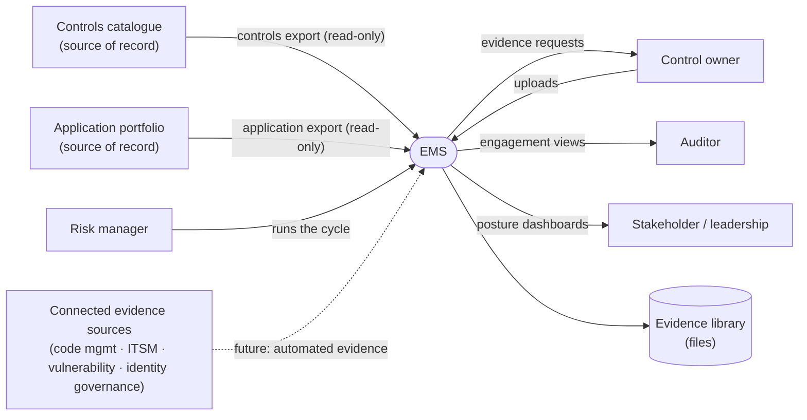
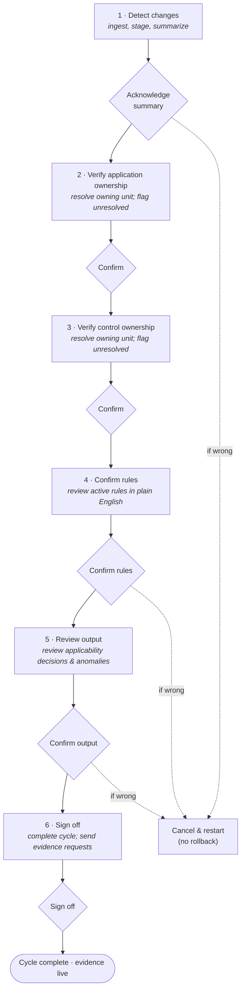
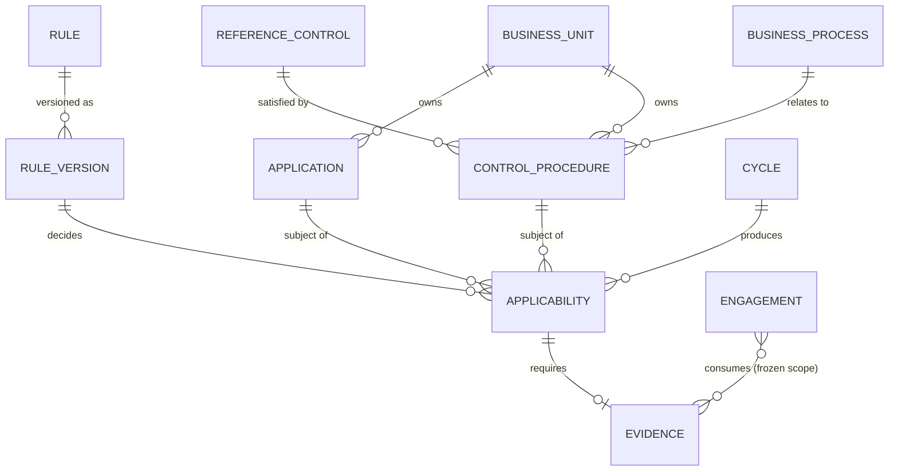

# EMS — Business Requirements Document

**System:** Evidence Management System (EMS)
**Document type:** Business Requirements Document
**Status:** For review and approval
**Audience:** Business stakeholders, project sponsors, audit and compliance, and the delivery team

---

## Document control

| Field | Detail |
|---|---|
| Document title | EMS — Business Requirements Document |
| Version | 1.0 |
| Status | For review and approval |
| Classification | Internal |
| Owner | Risk & Compliance (business owner) |
| Author | Business Analysis |
| Supersedes | — |

**Revision history**

| Version | Summary of change |
|---|---|
| 1.0 | Initial comprehensive issue. |

**Approvals** *(approved by role; signatures captured on the controlled copy)*

| Role | Responsibility | Approval |
|---|---|---|
| Business Sponsor | Owns the business case and funding | ☐ |
| Risk & Compliance Lead | Owns the requirements and accepts the outcome | ☐ |
| Audit Representative | Confirms the model meets audit needs | ☐ |
| Delivery Lead | Confirms the requirements are buildable | ☐ |

**Distribution:** project sponsors; risk and compliance leadership; internal audit; the delivery team; and nominated business stakeholders.

---

## Glossary

| Term | Meaning |
|---|---|
| **Application** | A software system in the organization's portfolio. |
| **Reference control** | A high-level control requirement the organization must satisfy. |
| **Control procedure** | The specific, implementable procedure that satisfies one or more reference controls. The unit for which applicability is decided. |
| **Business process** | A business activity that controls relate to; consumed by EMS as read-only reference. |
| **Business unit** | The part of the organization that owns a given application or control. |
| **Rule** | A readable statement that decides when a control applies, and how widely evidence is needed. |
| **Rule version** | A frozen, immutable copy of a rule as it stood at a point in time. |
| **Reach (collection scope)** | How widely evidence is required for a rule: once centrally, once per application, or once per application within the owning business unit. |
| **Applicability** | The decision that a given control procedure does (or does not) apply to a given application. |
| **Evidence** | The proof that a control is being followed for a specific application. |
| **Evidence state** | Where a piece of evidence is in its life: gap, pending, approved, expired, or no longer required. |
| **Cycle** | The periodic guided review that detects change, decides applicability, and produces evidence requirements. |
| **Snapshot** | A frozen point-in-time copy of a control, application, and rule as they were at the moment of a decision or collection. |
| **Engagement** | An audit, regulatory review, or assessment that consumes evidence with its scope frozen at activation. |
| **Gap** | An applicable control that has no valid evidence. |
| **Freshness** | Whether evidence is still within its validity window. |
| **Automated evidence consumption** | Reading evidence directly from the source systems that already produce it, rather than collecting it from people. |

---

## 1. Executive summary

The organization runs hundreds of applications and must satisfy hundreds of information-security controls. Working out *which controls apply to which applications, and what evidence proves compliance,* is today a manual, periodic, error-prone exercise — repeated every cycle because both the application list and the controls catalogue keep changing, and intensified into a scramble whenever an audit arrives.

**EMS turns that exercise into a standing, automated capability.** It sits between the controls catalogue and the application portfolio — owning neither, changing neither — and answers the question they imply but neither one answers alone: *what must we prove, have we proved it, and is the proof still good?* It does this with a **rule-driven, two-rhythm model**: a continuous background cycle that decides applicability and keeps evidence current, and episodic engagements (audits and reviews) that consume that evidence with their scope frozen at activation.

Two properties make EMS trustworthy to an auditor. **Applicability is decided by readable rules, not opaque logic** — any decision can be shown, in plain English, as the exact rule that produced it. And **the record is tamper-resistant by design** — evidence is never deleted, every official status is written automatically rather than typed by a person, and the past cannot be quietly rewritten.

**The intended outcome:** the periodic, multi-hour manual exercise is replaced by a low-touch one of roughly fifteen to twenty minutes per cycle; coverage is continuous and always reportable; audit preparation becomes a matter of opening a view rather than mounting a project; and every change carries a complete, attributable history. This document defines the business need, scope, stakeholders, requirements, and the criteria by which EMS will be judged successful.

## 2. Business context

EMS is a business application — built on the organization's standard low-code platform — that automates the collection, organization, and audit-readiness of compliance evidence across the organization's application portfolio.

It sits between two systems of record the organization already operates:

- **The controls catalogue** — the authoritative source for the organization's information-security controls, control procedures, and the business processes they relate to.
- **The application portfolio** — the authoritative inventory of every application the organization runs, together with its attributes (hosting, criticality, owning business unit, and technical characteristics).

EMS does not own controls or applications, and never modifies either source. It is the intersection where the two meet: which controls apply to which applications, what evidence is required, and whether that evidence has been collected, approved, expired, or carried forward.

**The problem.** A typical enterprise has hundreds of applications and hundreds of control procedures. The combination is tens of thousands of possible control-to-application intersections — but only some are real. SOX-only controls don't apply to non-SOX applications; physical-access controls don't apply to cloud-only services; identity controls apply differently depending on whether an application uses single sign-on. Without automation, deciding what is in scope, requesting evidence, chasing responses, and assembling audit packages is slow, inconsistent, and endlessly repeated.

**The approach.** EMS replaces the manual exercise with two rhythms that are deliberately kept apart: **continuous collection** that runs in the background indefinitely, and **episodic engagements** that consume the steady-state evidence. Risk managers review **rule outcomes** rather than individual records — orders of magnitude less manual effort per cycle.

**Figure 1 — System context.**

*EMS reads from the two sources of record and never writes back to them. It serves each role a different slice. Connected evidence sources (dashed) are the committed future direction — see §4.3.*

## 3. Business objectives & benefits

The targets below express what EMS is expected to achieve. As the system is not yet in production, each is stated as a target with the measure by which it will be confirmed at and after go-live.

| Objective | Target | How confirmed |
|---|---|---|
| Cut per-cycle manual effort | Order-of-magnitude reduction — from a multi-hour exercise to roughly **15–20 minutes** of risk-manager time per cycle in steady state | Time-on-task per cycle against a first-production baseline |
| Continuous evidence coverage | **100%** of applicable control-to-application intersections held in a known evidence state at all times | Coverage report (complete vs missing), available on demand |
| Audit-readiness on demand | Required evidence and gaps surfaced **immediately** at engagement activation, with no new collection effort | Time to assemble scope at engagement start |
| Fully attributable change history | **100%** of changes to protected fields traceable to an automatic, system-performed action | Audit-trail completeness check |
| Deterministic, explainable applicability | **100%** of applicability decisions reproducible from the rule version that produced them and readable in plain English | Decision-to-rule reconstruction |
| Eliminate avoidable rework | Valid evidence is **not re-requested** where reuse applies | Reuse-acceptance vs duplicate-request rate |
| Prevent silent staleness | Evidence past its freshness window is **always detected before** an audit, never discovered during one | Proportion of expiries flagged ahead of lapse |

**Qualitative benefits.** Audit preparation shifts from a recurring fire-drill to a routine view; compliance decisions become consistent and explainable rather than dependent on one person's judgement each cycle; the trail is complete and tamper-resistant; and effort is no longer wasted re-collecting proof the organization already holds.

## 4. Scope

EMS automates the evidence problem that sits *between* the controls catalogue and the application portfolio, and does not duplicate or compete with either.

### 4.1 In scope

- **Continuous evidence collection** — each period, detect source changes, apply the rules, and produce evidence records for the applicable intersections.
- **Rule-driven applicability** — a versioned, deterministic rule set decides applicability; each rule carries its own reach.
- **AI-assisted evidence reuse** — propose reusing existing valid evidence for the risk manager to accept or reject.
- **Evidence lifecycle workflow** — upload, approval, expiry, freshness tracking, and reuse review.
- **Gap detection** — surface applicable controls with no valid evidence.
- **The six-stage guided review cycle** — a gated process, one approved step at a time.
- **Engagements** — audits, regulatory reviews, and assessments that consume the steady-state evidence, with scope frozen at activation.

### 4.2 Out of scope

- **Source-system data quality** — remediating data in the source systems is not EMS's responsibility.
- **Controls-framework authoring** — the controls catalogue owns the library; EMS consumes it.
- **Application-portfolio mastering** — the portfolio owns application data; EMS reads it.
- **Driving collection from engagements** — engagements consume evidence; they never create new requirements.

### 4.3 Target direction

The model above describes evidence that is **provided** — a control owner uploads a file in response to a request. The committed production direction is **automated evidence consumption**: over time, EMS consumes evidence **directly from the systems that already produce it**. The intended sources and what each supplies:

- **The code-management system** — change reviews, branch-protection policies, deployment approvals.
- **The IT service-management system** — change records, incident remediation, access requests.
- **The vulnerability-scanning platform** — vulnerability and configuration-scan results.
- **The identity-governance system** — access certifications, role assignments, segregation-of-duties checks.
- **The applications' own interfaces** — configuration snapshots, audit logs, transaction samples.

Under this model, evidence arrives through three input modes — connected source systems read directly, the outputs of upstream control-monitoring platforms flowing in, and manual owner-provided artifacts where automation isn't possible — and people shift from being the primary suppliers of evidence to being the **exception-handlers and reviewers** of automated ingestion. Two further directions are committed: **delivering evidence requests through a team's own work-tracking tools** rather than only by email; and supporting **ad-hoc, between-cycle reclassification** for changes that cannot wait for the periodic cycle.

## 5. Stakeholders

EMS serves seven roles, with deliberately non-uniform access — each role's reach matches how its work operates. Two external systems are stakeholders in the data sense, as authoritative upstream sources.

### 5.1 EMS roles

| Role | Scope | What they do |
|---|---|---|
| **System administrator** | Organization-wide | Configures the rules catalogue and the business-unit structure; owns the administrative surfaces. A small, named group. |
| **Risk manager** | A single business unit per assignment | Runs the evidence cycle, manages master data, oversees evidence for their unit. The primary operator. |
| **Control owner** | The records they own | Provides and maintains evidence for the controls assigned to them, through a simplified portal. |
| **Control tester** | Read-only, organization-wide | Browses the controls catalogue for testing purposes, without write access. |
| **Auditor** | A single engagement | Sees only the records in scope for the engagement they are assigned to. |
| **Stakeholder** | Read-only, organization-wide aggregates | Consumes dashboards and summaries; does not see record-level detail. |
| **The system itself** | Automated, non-human identity | Performs every protected action, so every official change is consistently attributable. |

### 5.2 External (data) stakeholders

- **The controls catalogue** — authoritative source for controls, procedures, and business processes; consumed via periodic export.
- **The application portfolio** — authoritative source for applications and their attributes; consumed via periodic export.

## 6. Business process

### 6.1 Two rhythms

EMS runs two tempos that are kept apart. The **continuous rhythm** is the periodic evidence cycle that keeps evidence flowing and current, indefinitely, without anyone actively managing it. The **episodic rhythm** is an engagement — an event with a deadline and findings — which consumes the evidence the continuous rhythm has gathered. The continuous rhythm produces; the episodic rhythm consumes. Neither drives the other.

### 6.2 The evidence cycle (six stages)

The continuous rhythm runs a guided cycle every period — typically monthly. The risk manager moves through six checkpoints, in order, approving each before the next becomes available. An approved checkpoint cannot be quietly reversed; if something is wrong, the cycle is cancelled and restarted rather than rolled back.

**Figure 2 — The six-stage cycle.**

| Stage | Risk-manager time | Gate |
|---|---|---|
| 1. Detect changes | seconds | Acknowledge the summary |
| 2. Verify application ownership | seconds | Confirm resolution |
| 3. Verify control ownership | seconds | Confirm resolution |
| 4. Confirm rules | a few minutes | Confirm rules |
| 5. Review output | a few minutes | Confirm output |
| 6. Sign off | seconds | Sign off |

In steady state, the whole cycle takes roughly **fifteen to twenty minutes** — down from surveying thousands of intersections by hand.

## 7. Functional requirements

Each requirement carries a **priority** (Must / Should / Could / Future, in the MoSCoW sense) and **acceptance criteria** stated in business terms.

### 7.1 Automated data synchronization — *Must*

Each period, EMS reads control and application data from the two sources and synchronizes it with its own records, detecting what is new, changed, and removed.

*Acceptance criteria:* every new, changed, and removed source record is identified and staged for review; no source record is silently dropped or overwritten; a plain-language summary of the period's changes is produced each cycle; the import tolerates a changed source export format (a renamed or added column) without failing.

### 7.2 Rule-driven applicability — *Must*

A deterministic, versioned rule engine decides which applications each control applies to, evaluating each application's fifteen key attributes against the active rule set. Each rule carries its own reach; every decision is reproducible from the rule version that produced it.

*Acceptance criteria:* the same application data and rule set always yields the same applicability result; each decision can be traced to the specific rule version that produced it and read in plain English; where a rule depends on a missing attribute, the affected application is flagged for a person rather than silently decided; rules are versioned — editing a live rule preserves the prior version, and retiring a rule deactivates rather than deletes it.

### 7.3 AI-assisted evidence reuse — *Should*

When new evidence would be created, the system proposes reusing existing valid evidence, matched on a point-in-time snapshot of the control and application, for the risk manager to accept or reject.

*Acceptance criteria:* a reuse proposal is offered only when a genuine candidate exists; the risk manager can accept or reject each proposal; on acceptance, no duplicate request is raised; the basis for the match is visible to the reviewer.

### 7.4 Evidence linking & gap detection — *Must*

For changed controls, EMS checks whether existing evidence remains valid, and surfaces gaps against applicable controls.

*Acceptance criteria:* every applicable intersection resolves to a known evidence state; controls with no valid evidence are reported as gaps; a complete-versus-missing count is available on demand.

### 7.5 The six-stage guided review — *Must*

A guided, gated process walks the risk manager through the six stages of each cycle, one human approval per stage.

*Acceptance criteria:* stages are completed strictly in order — a later stage cannot be reached until the prior gate is approved; an approved gate cannot be reversed within the cycle; a cycle with no changes can be completed without busywork; correcting an error means cancelling and restarting the cycle, not undoing a step.

### 7.6 Evidence collection — *Must*

Control owners see their assigned evidence requests and upload the proof through a portal built for their needs.

*Acceptance criteria:* a control owner sees their own outstanding requests and no others; an upload moves the evidence to a pending (provided, not yet reviewed) state; the original request and its status remain visible to the owner.

### 7.7 Evidence approval workflow — *Must*

The full life of a piece of proof — needed, provided, approved, expired, renewed — with the system recording each step.

*Acceptance criteria:* the risk manager can approve provided evidence or return it as still missing with a reason; the official status is written by the system, not typed by a person; status moves forward only — it cannot be moved backward; nothing is deleted, including evidence that ceases to apply.

### 7.8 Evidence freshness tracking — *Should*

EMS watches evidence age, expiry dates, and overdue requests, and raises alerts before anything lapses.

*Acceptance criteria:* every piece of evidence has an expiry; evidence approaching or past expiry is flagged automatically; overdue requests are surfaced; a freshness issue is detectable before, not only during, an audit.

### 7.9 Compliance dashboard — *Should*

Read-only views of how complete coverage is — by control, by application, and by business unit — and what remains unmapped.

*Acceptance criteria:* coverage can be viewed sliced by control, application, and business unit; the dashboard is read-only; unmapped or incomplete areas are visible at a glance.

### 7.10 Controls catalogue browser — *Could*

A searchable view of every control, procedure, application, and business process.

*Acceptance criteria:* a user can search and browse controls, procedures, applications, and business processes within their access; the view is read-only.

### 7.11 Administration — *Must*

The configuration surfaces — the rules catalogue where rules are authored, synchronization settings, evidence types, and workflow configuration.

*Acceptance criteria:* an administrator can author, version, and retire rules; configuration changes are restricted to administrators; the rules catalogue is the single place rules are authored.

### 7.12 Control owner portal — *Should*

A separate, simplified application so a control owner sees only their own tasks and uploads, without the full system.

*Acceptance criteria:* a control owner can complete their tasks without access to the full system; the portal exposes only the owner's records and actions.

### 7.13 Engagement management — *Must*

Setting up and running audits, reviews, and assessments that consume the evidence with their scope frozen at activation, across six recognized kinds: **SOX quarterly checks, regulator inquiries, internal control reviews, vendor-risk assessments, incident reviews, and external audits.**

*Acceptance criteria:* an engagement's scope (controls, applications, business unit, time period) is defined at setup; the scope freezes at activation, so later source changes apply to future cycles only; the engagement surfaces in-scope evidence and gaps from already-collected evidence; an assigned reviewer sees only that engagement's contents; the engagement can record its own findings but cannot alter the underlying evidence; the engagement produces a summary at close.

### 7.14 Future-direction capabilities — *Future*

**Automated evidence consumption**, **evidence-request delivery through a team's own tools**, and **ad-hoc between-cycle reclassification** are committed directions for a later stage, defined in §4.3. They are recorded here for completeness and are not part of the initial delivery.

## 8. Non-functional requirements

EMS's non-functional posture centres on **security, auditability, and data integrity** — the qualities a governance, risk, and compliance platform is itself audited against. Reliability, availability, performance, and scalability are established against an operational baseline at first production use.

### 8.1 Security — *Must*

Role-based access control with deliberately **non-uniform scoping** — each role's reach matches how its work operates, rather than forcing one uniform scope onto every role.

*Acceptance criteria:* each of the seven roles is granted only the access its scope defines; a risk manager sees only their business unit; an auditor sees only their engagement; a control owner sees only their own records; read-only roles cannot write.

### 8.2 Auditability — *Must*

Auditability is a first-class property, produced by the way the system is built rather than added afterward.

*Acceptance criteria:* every change to protected data traces to a specific, automatic, system-performed action, with no anonymous or out-of-band edits; each piece of evidence carries a frozen point-in-time snapshot of the control and application as they were at collection; every applicability decision can be reconstructed from the rule version that produced it and read in plain English.

### 8.3 Integrity & retention — *Must*

*Acceptance criteria:* protected fields are written only by the system, never directly by any person (including an administrator), with no override path; approved checkpoints cannot be un-approved, master records cannot be edited by people, and evidence status cannot move backward; evidence is retained permanently and never deleted — only its status changes; an engagement's scope freezes at activation.

## 9. Conceptual data model

The model below is conceptual — the business entities and how they relate — not a physical schema. It exists so stakeholders share one picture of *what EMS keeps track of.*

**Figure 3 — Conceptual data model.**

**The entities, in plain terms:**

- **Reference control** — a high-level control requirement; **satisfied by** one or more **control procedures**.
- **Control procedure** — the implementable unit applicability is decided for; **owned by** a business unit and **related to** a business process.
- **Application** — a system in the portfolio; **owned by** a business unit; described by its key attributes.
- **Business unit** — owns applications and control procedures.
- **Rule / rule version** — a readable applicability statement and its frozen, immutable versions.
- **Cycle** — a periodic run that **produces** applicability decisions and the evidence requirements that follow.
- **Applicability** — the decision that a control procedure applies to an application, **decided by** a specific rule version; where applicable, it **requires** evidence.
- **Evidence** — the proof for an applicable intersection, with a state and a point-in-time snapshot.
- **Engagement** — an audit or review that **consumes** evidence within a scope frozen at activation; it observes evidence but never changes it.

## 10. Assumptions

- **Source-system boundaries.** The two sources are authoritative; EMS maintains no competing system of record.
- **Applicability uses structured attributes, not free-text interpretation.** The rule engine evaluates each application's structured attributes deterministically rather than interpreting control descriptions.
- **Records are deactivated, never destroyed.** Removed controls and decommissioned applications are marked inactive, not deleted.
- **Imports are resilient to source-format change.** The pipeline tolerates a renamed or added column rather than breaking.
- **Decommissioning is reversible within a window**, so a premature removal can be undone.
- **Only meaningful changes are surfaced**, so the risk manager sees only changes that actually affect evidence.
- **Engagement scope is fixed once activated**, so evidence cannot be invalidated mid-review.
- **Applicability work happens within the periodic cycle**; ad-hoc between-cycle reclassification is a recognized future need.

## 11. Constraints & principles

- **EMS consumes; it never masters.** It reads the two sources and never writes back.
- **Continuous collection feeds episodic engagements.** Engagements consume; they never drive collection.
- **The past is never rewritten.** Evidence is never deleted; approvals are never silently reversed; master records cannot be edited by people. Corrections happen openly, going forward.
- **No person writes the official record.** Every protected status is written by the system's automated identity, with no override path.
- **Applicability is deterministic and explainable.** Rules are readable statements; every decision traces to a rule version and reads in plain English.
- **Every meaningful step is human-approved.** The system sorts and records; a person reviews and approves at every gate.
- **Engagement scope is immutable once activated**, so the picture an auditor reviews never shifts beneath them.

## 12. Risks & mitigations

| Risk | Likelihood | Impact | Mitigation |
|---|---|---|---|
| **Source-data gaps** — missing application attributes lead to undecidable applicability | Medium | High | A rule that depends on a missing attribute flags the application for a person rather than guessing; data gaps surface as exceptions, not silent errors. |
| **Incorrect rules at scale** — a wrong rule misclassifies many intersections at once | Medium | High | Rules are reviewed in plain English at a dedicated cycle gate; they are versioned; every decision is reproducible and explainable, so errors are visible and correctable. |
| **Control-owner responsiveness** — manual evidence depends on people uploading on time | Medium | Medium | Owner portal, automated freshness alerts before lapse, and the committed move to automated consumption reduce reliance on chasing. |
| **Expectation gap** — stakeholders assume the automated future is present today | Medium | Medium | Scope and target-direction are stated explicitly (§4); this document distinguishes committed scope from future direction. |
| **Audit acceptance of the rule-driven model** — reviewers may distrust automated applicability | Low | High | Decisions are readable, reproducible, and snapshotted; an auditor can be shown the exact rule that decided any outcome. |
| **Integration complexity (future)** — automated consumption spans many heterogeneous systems | Medium | Medium | A phased trajectory, three input modes, and an exception-handling operating model rather than an all-at-once cutover. |
| **Key-person concentration** — one risk manager per business unit | Medium | Medium | Automation reduces per-cycle load to minutes; the role and access model supports reassignment and coverage. |
| **Adoption & change at go-live** — new ways of working across many roles | Medium | Medium | Migration and training are planned as explicit go-live activities; the people-facing surfaces are simplified per role. |

## 13. Success criteria

EMS is successful when the manual, periodic, error-prone evidence exercise is replaced by a continuous, auditable, low-touch one. The measurable tests:

- **Evidence coverage.** Every applicable control-to-application intersection has an evidence record in a known state, with a clear, reportable count of complete versus missing at any moment.
- **Evidence freshness.** Evidence past its freshness window is detected and flagged automatically, rather than discovered during an audit.
- **Cycle completion.** Each period's review cycle reaches sign-off through all six gated stages, with the active rule set captured as an auditable snapshot.
- **Low steady-state effort.** Risk-manager time per cycle stays in the low tens of minutes, versus reviewing thousands of intersections in the original model.
- **Audit-readiness on demand.** When an engagement is activated, its scope freezes and the required evidence — and any gaps — can be surfaced immediately, with no new collection scramble.
- **Attributable changes.** Every change to a protected field is traceable to an automatic, system-performed action, giving auditors a complete change history.
- **Deterministic, explainable applicability.** Every applicability decision can be traced to the specific rule version that produced it and read in plain English.

---

*This document captures EMS's business requirements. Requirement-to-design and requirement-to-test traceability is maintained in the companion Requirements Traceability Matrix. The detailed technical design that realizes these requirements is maintained separately.*
